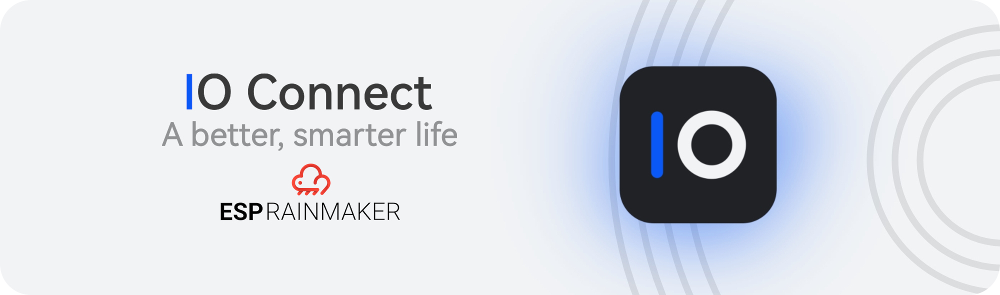

## HM IO Connect - ESP RainMaker

This is the IO Connect demo application which is based on [ESP RainMaker](https://github.com/espressif/esp-rainmaker), an end-to-end solution offered by Espressif to enable remote control and monitoring for ESP32-S2 and ESP32 based products without any configuration required in the Cloud. 

## IO Connect Android app

Control all of your ESP RainMaker devices with IO Connect Android app.

[](https://play.google.com/store/apps/details?id=com.codor.stelian.ioconnect)
[](https://appgallery.cloud.huawei.com/ag/n/app/C104694841)
[](https://drive.google.com/file/d/1j-78cbTYLboyCpS3v1mciMzks87leLDc/view?usp=sharing)

## Development

Prepare [ESP-IDF development environment](https://docs.espressif.com/projects/esp-idf/en/latest/esp32/get-started/index.html#get-started-get-prerequisites)

As an alternative, you can use [PlatformIO](https://docs.platformio.org/en/latest/core/installation.html) to build and
flash the project.

## Build and Flash firmware

Follow the ESP RainMaker Documentation [Get Started](https://rainmaker.espressif.com/docs/get-started.html) section to build and flash this firmware. Just note the path of this example.

Upload firmware package (.zip archive consisting of the binary, elf, map file, and other information useful for analysis) which you can find in the build/ folder of your project by navigating to the [Firmware Images](https://dashboard.rainmaker.espressif.com/home/firmware-images) of the ESP RainMaker Dashboard. Create a new OTA job and you are ready.

## What to expect?

- This demo application is intended to be used in Smart Home projects.
- It is designed for 6 devices:
	- 2 Lightbulbs (solid-state relay module)
	- RGB led ring with 24 pixels
	- Temperature Sensor (SHT31)
	- Humidity Sensor (SHT31)
	- Luminosity Sensor (BH1750)
- It uses the esp timer to get periodic data from the temperature, humidity, and luminosity sensors.
- The temperature and humidity values are refreshed every 5 minutes and the luminosity value is refreshed every minute.
- You can check the temperature, humidity, and luminosity changes in the phone app.
- There are some demo animations for RGB led ring like pulse and spinner. A future advanced implementation will be done.
- Toggling the buttons on the phone app should toggle the lightbulbs, and also print messages like these on the ESP32 monitor:

```
I (16073) app_main: Received value = true for Bedroom Light - power
```

- You may also try changing the hue, saturation, and brightness for RGB led strip from the phone app.

### RGB LED Ring, relays or sensors not working?

The RGB led ring is connected to GPIO 5. The solid-state relay module (4 channels) is connected to GPIO 19, 18, 17, and respectively 16. The temperature and humidity sensor (SHT31) and luminosity sensor (BH1750) are connected to GPIO 21(SDA) and GPIO 22(SCL).

### Reset to Factory

Press and hold the BOOT button for more than 3 seconds to reset the board to factory defaults. You will have to provision the board again to use it.

## License

    BSD 2-Clause License

    Copyright (c) 2021, Codor Stelian <codor.stelian.n@gmail.com>
    All rights reserved.
    
    Redistribution and use in source and binary forms, with or without
    modification, are permitted provided that the following conditions are met:
    
    1. Redistributions of source code must retain the above copyright notice, this
       list of conditions and the following disclaimer.
    
    2. Redistributions in binary form must reproduce the above copyright notice,
       this list of conditions and the following disclaimer in the documentation
       and/or other materials provided with the distribution.
    
    THIS SOFTWARE IS PROVIDED BY THE COPYRIGHT HOLDERS AND CONTRIBUTORS "AS IS"
    AND ANY EXPRESS OR IMPLIED WARRANTIES, INCLUDING, BUT NOT LIMITED TO, THE
    IMPLIED WARRANTIES OF MERCHANTABILITY AND FITNESS FOR A PARTICULAR PURPOSE ARE
    DISCLAIMED. IN NO EVENT SHALL THE COPYRIGHT HOLDER OR CONTRIBUTORS BE LIABLE
    FOR ANY DIRECT, INDIRECT, INCIDENTAL, SPECIAL, EXEMPLARY, OR CONSEQUENTIAL
    DAMAGES (INCLUDING, BUT NOT LIMITED TO, PROCUREMENT OF SUBSTITUTE GOODS OR
    SERVICES; LOSS OF USE, DATA, OR PROFITS; OR BUSINESS INTERRUPTION) HOWEVER
    CAUSED AND ON ANY THEORY OF LIABILITY, WHETHER IN CONTRACT, STRICT LIABILITY,
    OR TORT (INCLUDING NEGLIGENCE OR OTHERWISE) ARISING IN ANY WAY OUT OF THE USE
    OF THIS SOFTWARE, EVEN IF ADVISED OF THE POSSIBILITY OF SUCH DAMAGE.