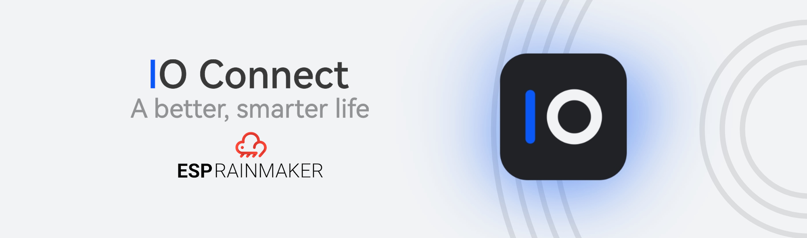

## HM IO Connect - ESP RainMaker (Working in progress)

This is the main project for IO Connect based on [ESP RainMaker](https://github.com/espressif/esp-rainmaker), an end-to-end solution offered by Espressif to enable remote control and monitoring for ESP32-S2 and ESP32 based products without any configuration required in the Cloud. 

## Development

Prepare [ESP-IDF development environment](https://docs.espressif.com/projects/esp-idf/en/latest/esp32/get-started/index.html#get-started-get-prerequisites)

As an alternative, you can use [PlatformIO](https://docs.platformio.org/en/latest/core/installation.html) to build and
flash the project.

## Build and Flash firmware

Follow the ESP RainMaker Documentation [Get Started](https://rainmaker.espressif.com/docs/get-started.html) section to build and flash this firmware. Just note the path of this example.

### Reset to Factory

Press and hold the BOOT button for more than 3 seconds to reset the board to factory defaults. You will have to provision the board again to use it.

## License

    Copyright 2021 Codor Stelian 
     
    Licensed under the Apache License, Version 2.0 (the "License");  
    you may not use this file except in compliance with the License.  
    You may obtain a copy of the License at  
     
        http://www.apache.org/licenses/LICENSE-2.0  
     
    Unless required by applicable law or agreed to in writing, software  
    distributed under the License is distributed on an "AS IS" BASIS,  
    WITHOUT WARRANTIES OR CONDITIONS OF ANY KIND, either express or implied.  
    See the License for the specific language governing permissions and  
    limitations under the License.
